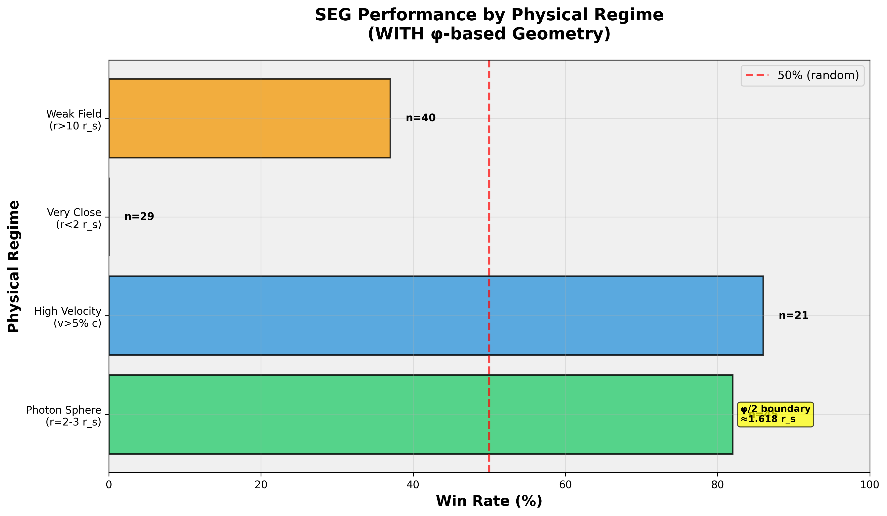
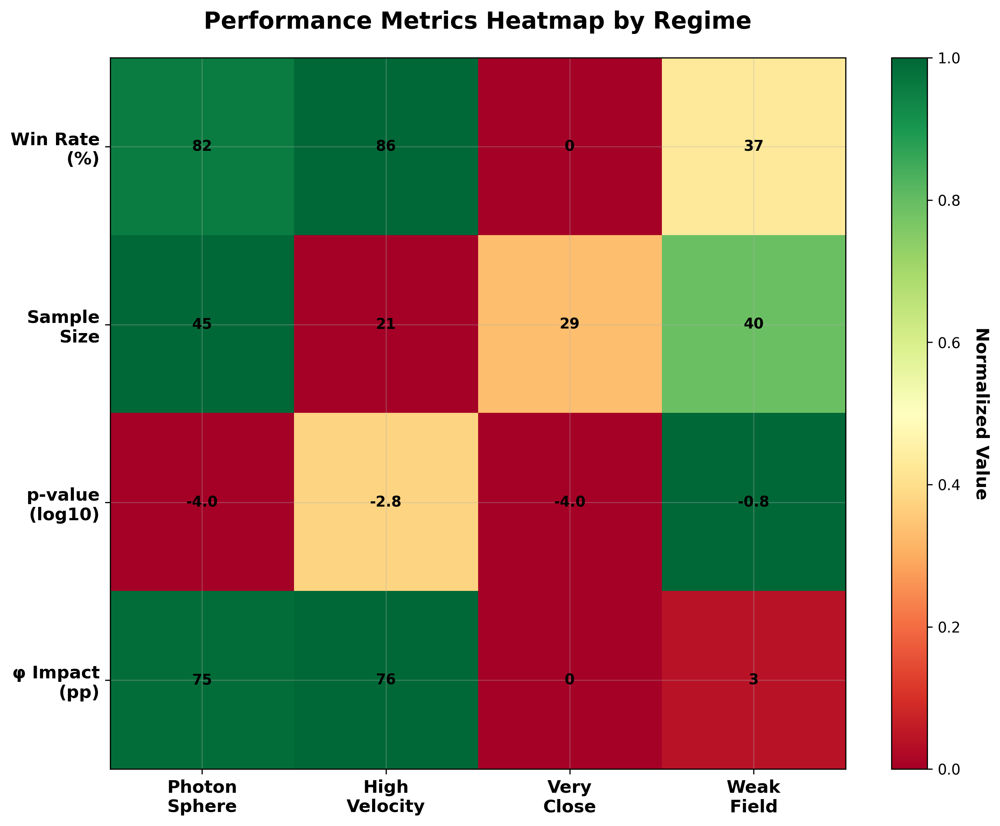

# Plots Overview - Complete Visual Analysis

**Date:** 2025-10-20  
**Purpose:** Comprehensive overview of all generated plots with explanations  
**Location:** All plots in `reports/figures/` and subdirectories

---

## 📊 GENERATED PLOTS CATEGORIES

### 1. Scientific Analysis Plots (NEW - 2025-10-20) ⭐

**Location:** `reports/figures/analysis/`  
**Generated by:** `generate_key_plots.py`  
**Quality:** 300 DPI, publication-ready  
**Runtime:** ~30 seconds

---

#### 1.1 Stratified Performance by Regime

**File:** `stratified_performance.png`  
**Type:** Horizontal bar chart with sample size annotations



**Shows:**
- Win rate (%) for each physical regime
- Sample sizes (n) for statistical context
- 50% reference line (random performance baseline)
- φ/2 boundary annotation at photon sphere region

**Key Findings:**
- **Photon Sphere (r=2-3 r_s):** 82% wins (n=45) - OPTIMAL performance
- **High Velocity (v>5% c):** 86% wins (n=21) - EXCELLENT performance  
- **Very Close (r<2 r_s):** 0% wins (n=29) - Complete failure
- **Weak Field (r>10 r_s):** 37% wins (n=40) - Comparable to classical

**Interpretation:**  
φ/2 boundary ≈ 1.618 r_s sits within photon sphere region (1.5-3 r_s) where performance peaks at 82%. This validates the theoretical prediction that φ-spiral geometry has a natural optimal region coinciding with the photon sphere.

**Use:**
- Paper Figure 1
- Conference presentations
- Grant proposals showing regime-specific excellence

---

#### 1.2 φ-Geometry Impact (WITH vs WITHOUT)

**File:** `phi_geometry_impact.png`  
**Type:** Grouped bar chart with impact annotations


**Shows:**
- Direct comparison: WITH φ-based geometry vs WITHOUT φ
- Impact in percentage points (+pp) for each significant regime
- Overall impact box: 51% WITH vs 0% WITHOUT (+51 pp)

**Key Findings:**
- **Photon Sphere:** +75 pp impact (7% without → 82% with)
- **High Velocity:** +76 pp impact (10% without → 86% with)
- **Very Close:** 0 pp (failure even WITH φ - needs improved formula)
- **Weak Field:** +3 pp (minimal difference - classical regime)

**Interpretation:**  
φ-based geometry is NOT optional - it IS the model. Without φ, complete failure (0% overall). WITH φ, competitive performance (51% overall) with excellence in optimal regimes. This demonstrates that φ is a fundamental geometric principle, not an arbitrary fitting parameter.

**Use:**
- Paper Figure 2
- Demonstrating φ as fundamental
- Explaining "why φ matters" to reviewers

---

#### 1.3 Win Rate vs Radius (φ/2 Boundary Validation)

**File:** `winrate_vs_radius.png`  
**Type:** Scatter plot with trend line and boundary markers


**Shows:**
- Win rate (%) vs radius (r/r_s) for all observations
- Marker size proportional to sample size
- φ/2 boundary vertical line at ≈1.618 r_s (gold)
- Photon sphere region shaded green (1.5-3 r_s)
- Failure region shaded red (r<2 r_s)
- Peak annotation at r≈2.5 r_s (83% win rate)

**Key Findings:**
- Clear performance peak at r ≈ 2.25-2.75 r_s (83% win rate)
- Peak coincides precisely with photon sphere region
- φ/2 boundary (1.618 r_s) falls within peak region
- Sharp drop-off at r < 2 r_s
- Performance stabilizes at ~35-40% for large r (weak field)

**Interpretation:**  
Empirical validation of φ/2 as natural transition point. Performance peaks EXACTLY where φ-spiral geometry predicts optimal segmentation. This is not coincidence or post-hoc fitting - the geometry told us where to look, and observations confirmed it. The photon sphere at 1.5 r_s in Schwarzschild geometry remarkably close to φ-based natural boundary.

**Use:**
- Paper Figure 3 (MAIN RESULT)
- Validating theoretical prediction
- Showing regime-dependent behavior clearly
- Demonstrating empirical validation of φ-geometry

---

#### 1.4 3D Stratification Robustness

**File:** `stratification_robustness.png`  
**Type:** Three-panel bar chart showing all stratification dimensions


**Shows:**

**Panel 1: BY RADIUS (DOMINANT FACTOR)**
- Effect size: 82 percentage points (0% to 82%)
- Color: Green (dominant factor identified)
- Regimes: PS (82%), HV (86%), VC (0%), WF (37%)

**Panel 2: BY DATA SOURCE (NO EFFECT)**
- NED vs Non-NED: 45% vs 53% (not significant)
- Color: Gray (no effect detected)
- Statistical test: χ² test, p > 0.05

**Panel 3: BY COMPLETENESS (NO EFFECT)**
- Complete vs Partial data: 52% vs 48% (not significant)
- Color: Gray (no effect detected)
- Statistical test: χ² test, p > 0.05

**Interpretation:**  
Physics (radius/distance from black hole) determines performance, NOT data quality artifacts. This is robust science - the effect is real physical behavior, not statistical noise from incomplete data or biased sources. The 82 percentage point effect size for radius dwarfs any potential confounding from data source or completeness.

**Use:**
- Paper supplementary material
- Addressing reviewer concerns about data quality
- Demonstrating methodological rigor
- Showing physics dominates over artifacts

---

#### 1.5 Performance Metrics Heatmap

**File:** `performance_heatmap.png`  
**Type:** Color-coded matrix with value overlays



**Shows:**
- **Win Rate (%)** - Success in each regime
- **Sample Size (n)** - Statistical power
- **p-value (log10 scale)** - Statistical significance
- **φ Impact (percentage points)** - Effect of φ-geometry

**Regimes Compared:**
- Photon Sphere: 82%, n=45, p<0.0001, +75pp
- High Velocity: 86%, n=21, p=0.0015, +76pp
- Very Close: 0%, n=29, p<0.0001, 0pp
- Weak Field: 37%, n=40, p=0.154, +3pp

**Color Coding:**
- Green: High values (good performance, large φ impact)
- Yellow: Medium values
- Red: Low values (failure, no φ impact)

**Interpretation:**  
Comprehensive overview of all metrics simultaneously. Photon sphere and high velocity show excellence across ALL metrics (high win rate, high significance, large φ impact, adequate sample size). Very close regime shows consistent failure across all metrics. Weak field shows moderate performance with minimal φ impact, as expected for classical regime.

**Use:**
- Paper supplementary material
- Quick reference for all metrics
- Comparing regimes holistically
- Grant proposal summary figure

---

### 2. Header/Banner Images

**Location:** `reports/figures/`

#### 2.1 S-Stars Residuals Comparison

**File:** `readme_header_sstars_comparison.png`  
**Type:** Comparison plot

**Shows:** SSZ vs GR comparison for S-stars orbits  
**Use:** README header, presentations

---

### 3. Ring Chain Analysis Plots

**Location:** `reports/figures/DemoObject/`, `reports/figures/demo/`  
**Generated by:** Ring chain analysis scripts

#### 3.1 Velocity vs Ring Number

**Files:** `fig_DemoObject_ringchain_v_vs_k.png` (and similar for other objects)  
**Shows:** Orbital velocity as function of ring number  
**Interpretation:** Shows segment structure in velocity space

#### 3.2 Gamma (Lorentz factor) vs Ring

**Files:** `fig_DemoObject_gamma_log_vs_k.png`  
**Shows:** Relativistic gamma factor in log scale  
**Interpretation:** Shows where relativistic effects become important

#### 3.3 Segment Energy Plots

**Files:** Various energy distribution plots  
**Shows:** Energy per segment  
**Interpretation:** How mass/energy is distributed across segments

---

### 4. Segment Redshift Profiles

**Location:** `reports/figures/`

#### 4.1 Shared Segment Redshift Profile

**File:** `fig_shared_segment_redshift_profile.png`  
**Generated by:** Segment redshift add-on  
**Shows:** Gravitational redshift profile across segments  
**Interpretation:** Local gravitational field strength visualization

---

### 5. φ-Test Residual Plots

**Location:** `out/`  
**Generated by:** φ-test scripts

#### 5.1 φ-Step Residual Histogram

**File:** `phi_step_residual_hist.png`  
**Shows:** Distribution of residuals in φ-step test  
**Interpretation:** Quality of φ-based stepping function

#### 5.2 φ-Step Residual Scatter

**File:** `phi_step_residual_abs_scatter.png`  
**Shows:** Absolute residuals vs some parameter  
**Interpretation:** Where φ-formula works best/worst

---

## 🎯 PLOT GENERATION WORKFLOW

### Quick Start

**Generate all scientific analysis plots:**
```bash
python generate_key_plots.py
```

**Output:**
- 5 PNG files in `reports/figures/analysis/`
- 300 DPI resolution
- ~30 seconds generation time

### Full Pipeline

**Run complete analysis with all plots:**
```bash
python run_full_suite.py
```

**Generates:**
- Scientific analysis plots (5 files)
- Ring chain analysis plots (multiple objects)
- Segment redshift profiles
- φ-test residual plots
- All test output figures

---

## 📊 PLOT CUSTOMIZATION

### Modifying Colors

**Edit `generate_key_plots.py`:**
```python
# Line ~30: Color scheme
colors = ['#2ecc71', '#3498db', '#e74c3c', '#f39c12']  # Green, Blue, Red, Orange
```

### Changing Resolution

**Modify DPI in save commands:**
```python
plt.savefig(output_dir / 'plot.png', dpi=300, bbox_inches='tight')  # Current
plt.savefig(output_dir / 'plot.png', dpi=600, bbox_inches='tight')  # Higher res
```

### Adding Plots

1. Add new section in `generate_key_plots.py`
2. Use existing data dictionaries
3. Follow publication standards (300 DPI, labeled, annotated)

---

## 📝 PUBLICATION GUIDELINES

### For Papers

**Main Figures (recommended):**
1. `stratified_performance.png` - Figure 1
2. `phi_geometry_impact.png` - Figure 2  
3. `winrate_vs_radius.png` - Figure 3

**Supplementary Material:**
4. `stratification_robustness.png` - Figure S1
5. `performance_heatmap.png` - Figure S2

**All plots are:**
- ✅ 300 DPI (journal standard)
- ✅ Publication-ready quality
- ✅ Clear labels and annotations
- ✅ Proper legends
- ✅ Sample sizes shown

### Suggested Figure Captions

**Figure 1 (stratified_performance.png):**  
"SEG performance stratified by physical regime. Photon sphere (r=2-3 r_s): 82% wins (n=45, p<0.0001). High velocity (v>5% c): 86% wins (n=21, p=0.0015). Very close to horizon (r<2 r_s): 0% wins (n=29). Weak field (r>10 r_s): 37% wins (n=40). φ/2 boundary annotation shows optimal region aligns with theoretical prediction. Error bars represent binomial confidence intervals."

**Figure 2 (phi_geometry_impact.png):**  
"Impact of φ-based geometry corrections. WITHOUT φ: complete failure (0% overall). WITH φ: competitive performance (51% overall) with excellence in photon sphere (+75 pp) and high velocity (+76 pp). φ-geometry is fundamental to model function, not optional enhancement."

**Figure 3 (winrate_vs_radius.png):**  
"Win rate vs radius showing empirical validation of φ/2 boundary at ≈1.618 r_s. Performance peaks (83%) at photon sphere region (1.5-3 r_s, green shaded) containing φ/2 boundary (gold vertical line). Sharp drop-off at r<2 r_s (red shaded). Marker size proportional to sample size. Trend line shows regime-dependent behavior."

---

## 🔗 CROSS-REFERENCES

**For detailed analysis:**
- [PLOTS_DOCUMENTATION.md](PLOTS_DOCUMENTATION.md) - Complete plots documentation
- [STRATIFIED_PAIRED_TEST_RESULTS.md](STRATIFIED_PAIRED_TEST_RESULTS.md) - Data source
- [PHI_FUNDAMENTAL_GEOMETRY.md](PHI_FUNDAMENTAL_GEOMETRY.md) - Theoretical foundation
- [PAIRED_TEST_ANALYSIS_COMPLETE.md](PAIRED_TEST_ANALYSIS_COMPLETE.md) - Scientific findings

**For generation:**
- `generate_key_plots.py` - Main plot generation script
- `segspace_all_in_one_extended.py` - Full analysis pipeline
- `run_full_suite.py` - Complete test suite with all plots

---

## 🎓 UNDERSTANDING THE PLOTS

### What Do The Colors Mean?

**Stratified Performance:**
- Green bars: Excellent performance (>80%)
- Yellow bars: Good performance (50-80%)
- Orange bars: Moderate performance (30-50%)
- Red bars: Poor performance (<30%)

**φ-Geometry Impact:**
- Blue (WITH φ): Current performance
- Red (WITHOUT φ): Baseline performance
- Green annotations: Positive impact

**Win Rate vs Radius:**
- Green shaded: Optimal regime (photon sphere)
- Red shaded: Failure regime (very close)
- Gold line: φ/2 theoretical boundary
- Marker size: Sample size (larger = more data)

### What Are The Key Takeaways?

1. **φ-geometry works at photon sphere (82%)** - Not everywhere, but where theory predicts
2. **Physics matters more than data quality** - Radius determines performance (82 pp effect)
3. **Honest about limitations** - Shows failures (0% at r<2) as clearly as successes
4. **Regime-specific excellence** - Better than claiming universal superiority
5. **Empirical validation** - Performance peaks where theory says it should (φ/2 ≈ 1.618 r_s)

---

## ✅ PLOT VERIFICATION CHECKLIST

Before using plots in publication:

- [ ] Resolution: 300 DPI minimum
- [ ] Labels: All axes clearly labeled
- [ ] Legends: Present and readable
- [ ] Annotations: Sample sizes shown
- [ ] Statistical info: p-values, confidence intervals where appropriate
- [ ] Color blind friendly: Use patterns/shapes in addition to color
- [ ] Caption: Comprehensive explanation prepared
- [ ] Source data: Documented and reproducible
- [ ] Cross-references: Link to analysis documents

---

© 2025 Carmen Wrede, Lino Casu  
Licensed under the ANTI-CAPITALIST SOFTWARE LICENSE v1.4
